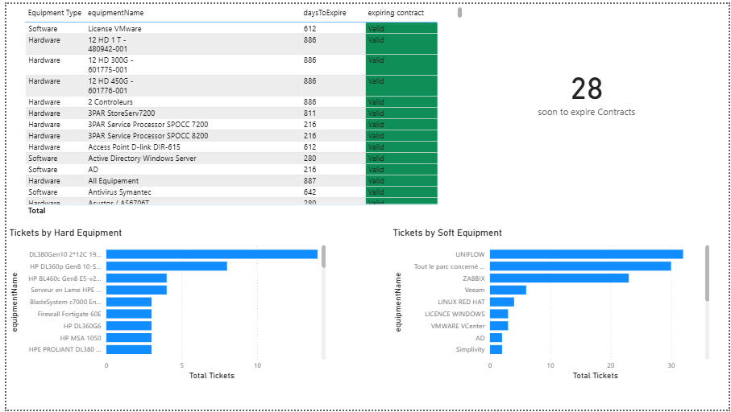

# PowerBi_dashboard
This project is a Power BI dashboard developed during my Data Analytics internship. It integrates data from seven cleaned databases (tickets, solutions, users, clients, sites, hardware, and software equipment) to provide actionable insights for technical and managerial teams.
# How to use
Open the `.pbix` file in Power BI Desktop to explore the dashboards.
# Screenshots

# Notes
⚠️ All client data has been anonymized.
# Download
[Download the Power BI dashboard](Dashboard_public.pbix)
